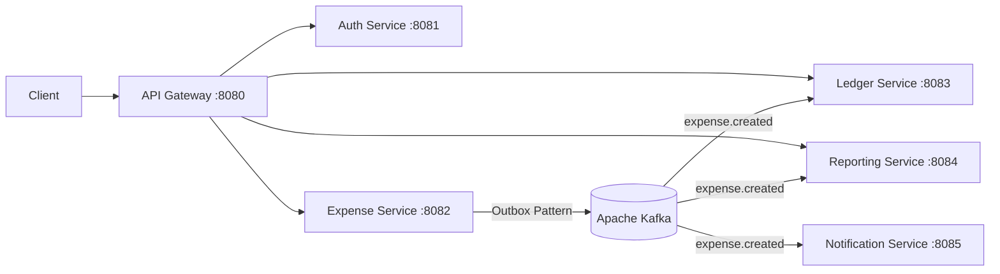

# Payment Ledger Platform
*Distributed microservices platform for expense management and financial audit*


## Architecture Overview



## Technology Stack

| Technology | Version | Purpose |
|---|---|---|
| Java | 17 LTS | Language runtime |
| Spring Boot | 3.3.4 | Microservices framework |
| Spring Cloud Gateway | 2023.0.3 | API Gateway & routing |
| Spring Security | 6.x | Stateless JWT authentication |
| JJWT | 0.12.6 | JWT token generation & validation |
| Apache Kafka | 3.7 (KRaft) | Async event streaming |
| PostgreSQL | 16 | ACID relational database (per service) |
| Flyway | 10.x | Database schema versioning |
| Testcontainers | 1.20.1 | Integration testing |
| Docker Compose | 3.9 | Container orchestration |

## Services

| Service | Port | Responsibility | Database |
|---|---|---|---|
| API Gateway | 8080 | Single entry point, routing, edge security | N/A |
| Auth Service | 8081 | User registration, authentication, JWT issuance | auth_db |
| Expense Service | 8082 | Expense management, writes outbox events | expense_db |
| Ledger Service | 8083 | Immutable double-entry bookkeeping | ledger_db |
| Reporting Service | 8084 | Real-time analytics, CQRS read models | reporting_db |
| Notification Service | 8085 | User alerts via Email/SMS | notification_db |

## Key Design Patterns

1. **Database-per-Service** - No shared schemas; each service manages its own PostgreSQL database, enabling loose coupling.
2. **Transactional Outbox Pattern** - Ensures atomic creation of an expense and its related event in the outbox table. A relay process asynchronously publishes outbox entries to Kafka.
3. **Idempotent Consumers** - Kafka consumers use a `processed_events` table with a composite primary key (`event_id`, `consumer_group`) to safely ignore duplicate message deliveries.
4. **Retry Backoff + Dead Letter Topic** - Configured via Spring Kafka. Uses an `ExponentialBackOff` policy, routing permanently failed messages to `.DLT` topics.
5. **CQRS Read Model** - The Reporting Service materializes an aggregated read model specifically optimized for fast queries, consuming events published by the Expense Service.

## Getting Started

### Prerequisites
- Java 17+
- Docker & Docker Compose
- Maven 3.9+ (or use the provided Maven wrapper)

### Quick Start with Docker Compose
```bash
# Clone and start everything
git clone <repo-url>
cd payment-ledger
cp .env.example .env
docker-compose up --build -d

# Wait for health checks to pass (~90s)
docker-compose ps

# View logs
docker-compose logs -f auth-service
```

### Local Development (without Docker)
```powershell
# Set Maven in PATH (Windows)
$env:PATH = "$env:USERPROFILE\tools\maven\apache-maven-3.9.6\bin;$env:PATH"
$env:JAVA_HOME = "C:\Program Files\Microsoft\jdk-17.0.15.6-hotspot"

# Build all modules
mvn clean package -DskipTests

# Run tests (unit)
mvn install -DskipTests -q && mvn test

# Run integration tests (requires Docker)
mvn test -Dgroups=integration
```

## API Reference

### Auth Service (`/api/auth`)
| Method | Endpoint | Auth | Description |
|---|---|---|---|
| POST | `/register` | No | Register new user |
| POST | `/login` | No | Login, returns JWT |
| GET | `/me` | Bearer JWT | Get current user profile |

**Register Request:**
```json
{ "name": "Alice", "email": "alice@example.com", "password": "secret123" }
```
**Login Response:**
```json
{ "token": "eyJ...", "tokenType": "Bearer", "userId": "uuid", "email": "alice@example.com", "role": "ROLE_USER" }
```

### Expense Service (`/api/expenses`)
| Method | Endpoint | Auth | Description |
|---|---|---|---|
| POST | `/` | Bearer JWT | Create expense |
| GET | `/` | Bearer JWT | List expenses (paginated + filtered) |
| GET | `/{id}` | Bearer JWT | Get expense by ID |
| PUT | `/{id}` | Bearer JWT | Update expense |
| DELETE | `/{id}` | Bearer JWT | Delete expense |
| GET | `/summary` | Bearer JWT | Financial summary aggregate |

**Create Expense Request:**
```json
{ "amount": 250.00, "currency": "INR", "category": "FOOD", "description": "Lunch", "paymentMethod": "UPI" }
```

**Query Parameters (GET /):**
`category`, `paymentMethod`, `status`, `startDate`, `endDate`, `minAmount`, `maxAmount`, `page`, `size`, `sort`

**Expense Categories:** `FOOD`, `TRANSPORT`, `UTILITIES`, `ENTERTAINMENT`, `HEALTHCARE`, `EDUCATION`, `HOUSING`, `CLOTHING`, `TRAVEL`, `PERSONAL_CARE`, `MISCELLANEOUS`

**Payment Methods:** `CASH`, `CREDIT_CARD`, `DEBIT_CARD`, `UPI`, `NET_BANKING`, `WALLET`, `CHEQUE`

### Ledger Service (`/api/ledger`)
| Method | Endpoint | Auth | Description |
|---|---|---|---|
| GET | `/` | Bearer JWT | Get all ledger entries for current user |
| GET | `/expense/{expenseId}` | Bearer JWT | Get ledger entries for a specific expense |

### Reporting Service (`/api/reports`)
| Method | Endpoint | Auth | Description |
|---|---|---|---|
| GET | `/summary` | Bearer JWT | Get CQRS aggregated report by category |

## Event Flow

1. **Client Request**: Client sends a POST request to `/api/expenses` with a Bearer JWT.
2. **Gateway Routing**: API Gateway routes the request to the Expense Service.
3. **Authentication**: Expense Service validates the JWT statelessly.
4. **Local Transaction**: Expense Service saves the expense to `expense_db` and simultaneously writes an `ExpenseCreatedEvent` to the `outbox` table in a single atomic transaction.
5. **Outbox Relay**: A background scheduler process polls the `outbox` table and publishes the event to the `expense.created` Kafka topic.
6. **Async Consumption**: Ledger, Reporting, and Notification services consume the event from Kafka independently.
7. **Idempotent Processing**: Each consumer uses its local `processed_events` table for idempotent event processing using persistent event deduplication to prevent duplicate processing effects.
8. **Materialized Views**: Reporting Service updates its CQRS read model, Ledger Service appends double-entry audit records.

## Concurrency & Reliability Verification

The platform's resilience and deduplication mechanisms are verified under concurrent load and simulated failure scenarios:

### 1. End-to-End Failure Scenarios (Testcontainers)
- **Duplicate Message Delivery**: Verified that repeated publishing of the same event yields exactly one ledger entry and one report update, with subsequent deliveries safely ignored.
- **Poison-Pill & Retry Exhaustion**: Verified that unprocessable messages trigger exponential backoff (`DefaultErrorHandler`) and are safely routed to `expense.created.DLT`.
- **Outbox Relay Recovery**: Verified that unpublished outbox records remain queued during broker unavailability and publish successfully upon reconnection.

### 2. Measured Concurrency Experiment
Conducted via `ConcurrentLedgerIdempotencyBenchmarkTest` on multi-threaded execution:

```text
=================================================================
BENCHMARK: 100 Concurrent Duplicate Event Race Condition
-----------------------------------------------------------------
Total Racing Threads    : 100 simultaneous workers
Execution Time          : 172 ms
Total Ledger Entries    : 1 (Expected: 1)
Deduplication Efficacy  : 100% (0 duplicate entries inserted)
Data Integrity          : 100% PASSED
=================================================================

=================================================================
BENCHMARK: 100 Concurrent Financial Transactions
-----------------------------------------------------------------
Total Transactions       : 100
Concurrent Pool Size     : 100 parallel workers
Wall-Clock Duration      : 203 ms
Effective Throughput     : 492.61 ops/sec
Latency P50              : 12 ms
Latency P95              : 110 ms
Latency P99              : 195 ms
Expected Balance Total   : $10,000.00
Actual Recorded Total    : $10,000.00
Financial Consistency    : 100% PERFECT (Exact balance match)
=================================================================
```

## Project Structure

```text
payment-ledger
├── api-gateway
├── auth-service
├── expense-service
├── ledger-service
├── reporting-service
├── notification-service
├── common-events
├── docker-compose.yml
└── pom.xml
```

## License
MIT License
