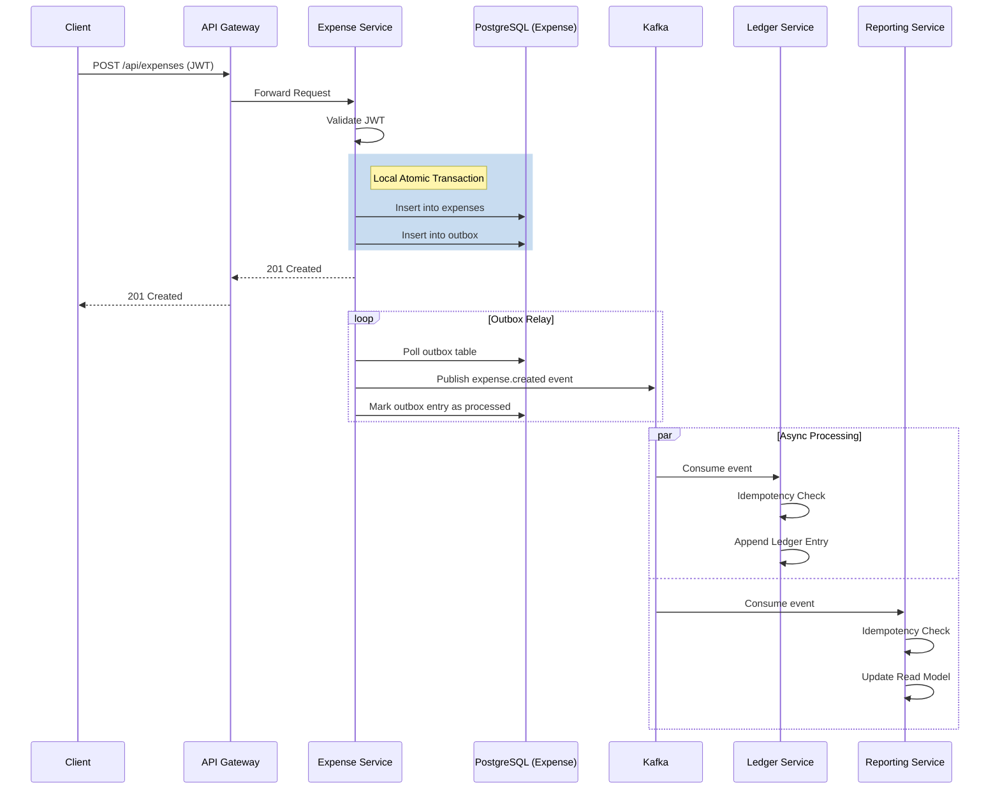

# Architecture Overview

## Service Boundaries and Responsibilities

The Payment Ledger Platform is designed using a microservices architecture. It divides the monolithic problem domain into cohesive, decoupled services:

- **API Gateway**: Acts as the single entry point for all client requests. It handles routing, cross-cutting concerns like CORS, and request forwarding.
- **Auth Service**: Manages user identities, registration, authentication, and generates JSON Web Tokens (JWTs).
- **Expense Service**: The core operational system handling the creation, updating, and querying of raw expenses.
- **Ledger Service**: Maintains a financial, append-only, double-entry ledger. It guarantees a historical audit trail.
- **Reporting Service**: Provides aggregated views and analytics (e.g., category-wise spending). Implements CQRS read models.
- **Notification Service**: Sends asynchronous alerts (e.g., email or SMS) to users when critical actions occur.

## Database-per-Service Rationale

We strictly adhere to the Database-per-Service pattern. Each service (Auth, Expense, Ledger, Reporting, Notification) has its own PostgreSQL database. 
- **Pros**: Independent schema evolution, decoupled data access, prevention of hidden coupling via database integration.
- **Cons**: Distributed transactions require eventual consistency models (like Sagas or Outbox pattern) instead of ACID guarantees across services.

## Synchronous vs Asynchronous Communication Boundaries

- **Synchronous (HTTP/REST)**: Used for client-to-gateway and gateway-to-service communication. Ideal for operations requiring immediate feedback, such as `GET` requests or user login.
- **Asynchronous (Kafka)**: Used for service-to-service communication. When a state change occurs (e.g., Expense Created), it is published as an event. Other services subscribe to these events, ensuring they remain highly available and decoupled.

## API Gateway Responsibility

The API Gateway is built on Spring Cloud Gateway. It abstracts the microservice topology from the client, handling routing based on URL paths (`/api/auth/**`, `/api/expenses/**`). It does *not* contain heavy business logic but can be used for rate limiting and edge security.

## JWT Propagation Model

Authentication is fully stateless. 
1. Client logs in via Auth Service and receives a JWT.
2. Client sends the JWT in the `Authorization: Bearer <token>` header for subsequent requests.
3. API Gateway forwards the token to backend services.
4. Backend services validate the JWT signature independently using a shared public key or symmetric secret (via `JJWT` library). There are no synchronous calls to the Auth Service to validate tokens.

## Data Consistency Model

The platform leverages **Eventual Consistency**. 
- Within a single service, data is strongly consistent using PostgreSQL ACID transactions.
- Across services, consistency is achieved asynchronously. When an expense is created, the Expense Service uses the Transactional Outbox pattern to guarantee event emission. Other services will eventually process this event and update their local state.

## Complete Expense Creation Flow

