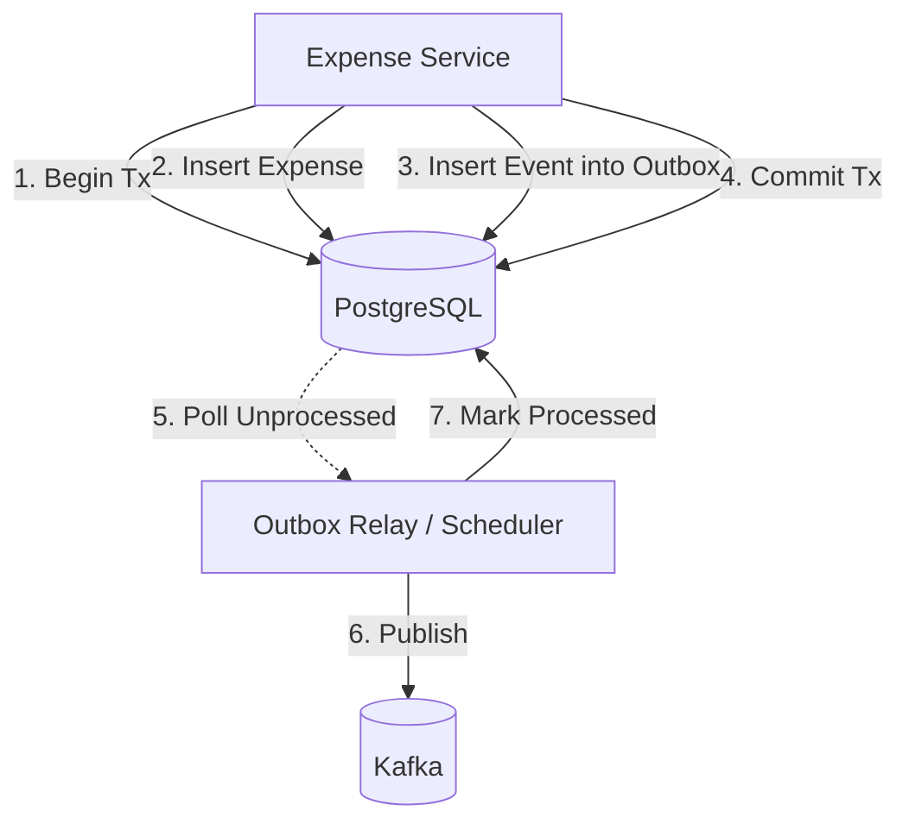

# Kafka Event Streaming Architecture

## Kafka Topic Inventory

| Topic Name | Partitions | Consumer Groups | Description |
|---|---|---|---|
| `expense.created` | 3 | `ledger-group`, `reporting-group`, `notification-group` | Emitted when a new expense is successfully saved. |
| `expense.updated` | 3 | `reporting-group` | Emitted when an expense is modified. |
| `expense.deleted` | 3 | `reporting-group` | Emitted when an expense is soft/hard deleted. |
| `user.registered` | 3 | `notification-group` | Emitted when a new user registers. |

## KRaft Mode

The platform runs Apache Kafka 3.7 using **KRaft (Kafka Raft)** mode. This eliminates the dependency on Apache ZooKeeper for metadata management, simplifying deployment, reducing latency, and improving cluster scalability.

## Partition Key Strategy

To guarantee strict ordering of events for a given user, we use the `userId` as the Kafka message partition key. 
- **Why?** If User A creates Expense 1 and Expense 2 in rapid succession, both events will hash to the same partition. Kafka guarantees ordered delivery within a partition. This ensures the Reporting Service updates aggregates in the correct sequence.

## Producer Configuration

Producers use a `StringSerializer` for keys and a JSON Serializer for values. We avoid embedding Java class type headers (`__TypeId__`) to prevent tight coupling between producer and consumer codebases. Consumers manually map the JSON payload to their local representation (DTOs/Records).

## Consumer Group Isolation

Each consuming service operates in its own dedicated Kafka Consumer Group (e.g., `ledger-group`, `reporting-group`). 
- **Benefit**: Kafka implements the Publish-Subscribe pattern across groups. A single `expense.created` event is independently delivered to each group, allowing all downstream systems to react at their own pace without stealing messages from one another.

## Message Format / Schema

Events are serialized as JSON. Example `ExpenseCreatedEvent`:

```json
{
  "eventId": "f47ac10b-58cc-4372-a567-0e02b2c3d479",
  "eventType": "EXPENSE_CREATED",
  "timestamp": "2023-10-27T10:00:00Z",
  "payload": {
    "expenseId": "e987fbc9-4bed-4020-b461-9f939e0eb3e1",
    "userId": "u123456",
    "amount": 250.00,
    "currency": "INR",
    "category": "FOOD",
    "paymentMethod": "UPI"
  }
}
```

## Transactional Outbox Pattern

To prevent the "Dual Write" problem (where saving to the database succeeds but publishing to Kafka fails, or vice-versa), we use the Transactional Outbox Pattern.


